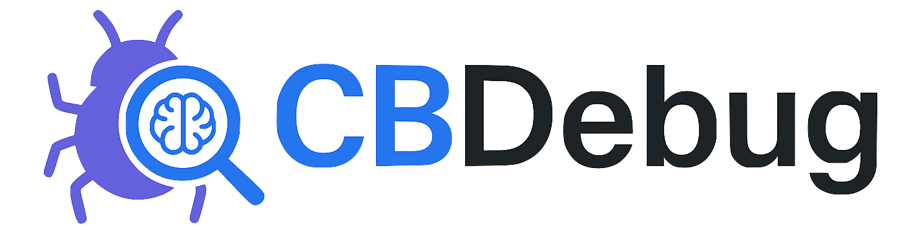
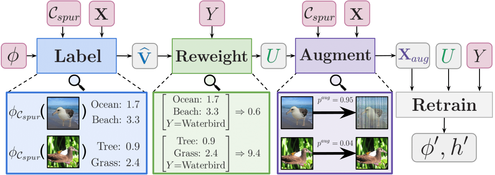
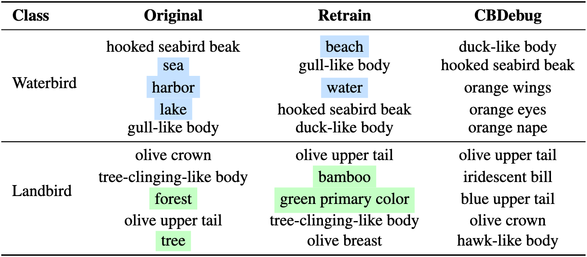

<h1 align="center">
  Debugging Concept Bottleneck Models<br>
  through Removal and Retraining
</h1>

<p align="center">
  
</p>


<p align="center">
  <strong>Eric Enouen, Sainyam Galhotra</strong><br>
  Cornell University<br>
</p>


This is the official repository for our work, [CBDebug](https://ericenouen.github.io/cbdebug/).
```bibtex
@article{enouendebugging,
  title={Debugging Concept Bottleneck Models through Removal and Retraining},
  author={Enouen, Eric and Galhotra, Sainyam},
  journal={arXiv preprint arXiv:2509.21385},
  year={2025}
}
```

---

## Overview

<p align="center">
  
</p>

**CBDebug (Concept Bottleneck Debugger)** is a framework for debugging concept bottleneck models using human feedback. A domain expert first identifies and removes spurious concepts learned by the model, then CBDebug retrains the model based on this feedback using a reweighting and augmentation scheme to force the model to rely on more robust, meaningful concepts.

With our data balancing scheme, we can effectively retrain the model based on user feedback to remove reliance on spurious correlations and replace those with more robust concepts for the classification task.

<p align="center">
  
</p>

---

## Getting Started

### Dependencies
See `requirements.txt`

### Datasets
For the Waterbirds and CelebA datasets, run the following command
```bash
python download.py --data_path data/ waterbirds,celeba --download
```
For the MetaShift dataset, we use the annotations from COCO instead of Visual Genome to construct the cat vs. dog dataset. Follow the instructions from their README: https://github.com/Weixin-Liang/MetaShift.

### Getting Started
In this section, we will explain how to run results for Post-hoc CBM. Post-hoc CBM requires a concept bank to perform augmentation, see https://github.com/Wuyxin/DISC for details on downloading this synthetic concept bank and save it to pcbm/concept_banks/synthetic_concepts_disc.

#### 1. Train
Train the original models on the datasets.

```bash
./scripts/debug.sh pcbm
```

#### 2. Automated Debugging
Run automated feedback generation to collect spurious concepts.

```bash
./scripts/auto_user.sh
```

You can also explore the user_study folder for manual feedback setup.

#### 3. Retrain with Refined Concepts
Fine-tune the models based on the different retraining algorithms.

```bash
./scripts/retrain.sh pcbm
```

#### 4. Evaluate Performance

Compute the average and worst-group accuracy of the trained models.

```bash
./scripts/eval.sh pcbm
```
